# Domain Driven Design Training

**Slide by Slide Extraction from PowerPoint Presentation**

---

## Slide 1

Agile Internal Training Day 2

---

---

---
---

*[Image(s) for Slide 1]*

---

## Slide 2

Domain Modeling With Class Responsibility Cards and Domain Driven Design

---

---

---
---

*[Image(s) for Slide 2]*

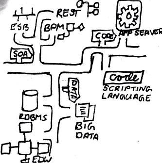

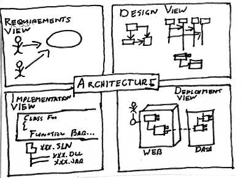

---

## Slide 3

The number one reason for failure of software projects is a failure of people to communicate

Language wall between clients and developers)

Domain Models are a Ubiquitous Language,

tight collaboration from both business and delivery teams

drawn in the language of the business

constrained by technology, using technical structure

One model for the code, the diagrams, and the language people use!

Business terms, concepts, etc, used by solution

Business Logic layer of solution

Business logic layer of solution

Business aspects of all layers of the solution (UI, DB, etc)

Business terms not part of the scope of the solution

Business terms part of the of the solution, that are not explicit in the solution

---

---
---

*[Image(s) for Slide 3]*

---

## Slide 4

The number one reason for failure of software projects is a failure of peopleto communicate

One layer of the solution is built using the language of the model

For cut dev this is the business logic layer

For package, the interfaces and testing layer are good candidates

Use one set of terms across the solution and problem space

Language permeates stories, test cases, database, service methods, etc

One model for the code, the diagrams, and the language people use!

---

---
---

*[Image(s) for Slide 4]*

---

## Slide 5

Two Agile Methods Key to Building A Domain Model

Domain Driven Design

An agile methodology for evolving a software system that closely aligns  to business requirements

A Practice to Maintain a Domain Model

A selective abstraction of knowledge from business domain experts

Responsible for representing business concepts, information about business situations, business state, and business rules

Evolves to represent the constraints of the technical solution as it becomes more well understood

A common, ubiquitous language to express business terms using a vocabulary that both technical and business can use

Class responsibility Card Modelling

An Agile Modelling technique to visually represent whole or part of an application or problem domain

Quickly explore, shape, and discard domain concepts

We will be using CRC to practice Domain Driven Design

---

---

## Slide 6

Domain Modelling with CRC

---

---

## Slide 7

Starting Simple: Using A Domain model to elaborate on our story map

---

---

---
---

*[Image(s) for Slide 7]*

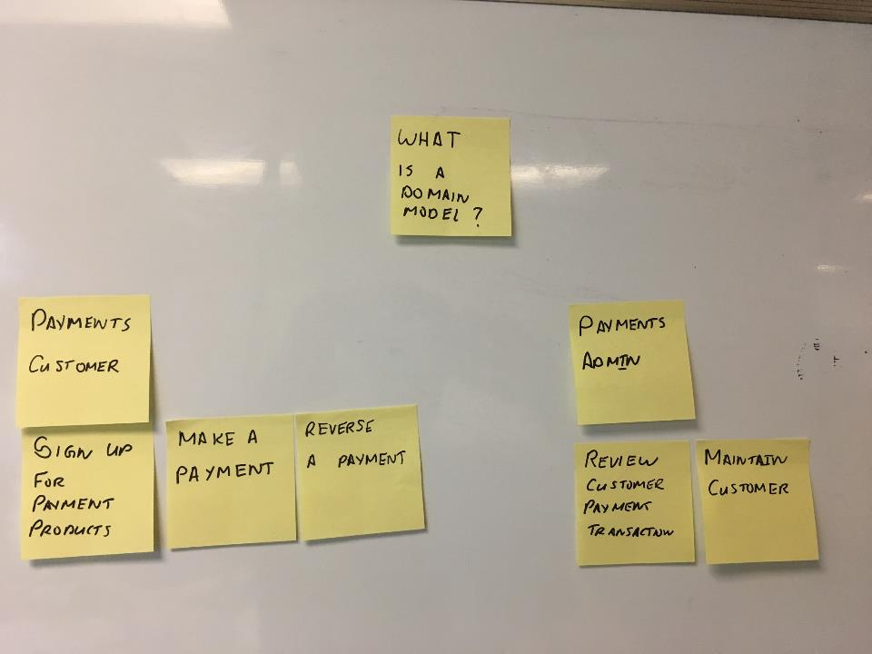

---

## Slide 8

Starting Simple: Using A Domain model to elaborate on our story map

Payments Customer

Sign Up For Payments Products

Make A Payment

Reverse A Payment

Payments Admin

Review Customer Payment

Maintain Customer

---

---

## Slide 9

Starting Simple: Using A Domain model to elaborate on our story map

Payments Customer

Sign Up For Payments Products

Make A Payment

Reverse A Payment

Payments Admin

Review Customer Payment

Maintain Customer

What do  we mean by a payments customer?

User? Company? Department?  Representative?

How Do we ID one?

What Information is required to make a payment?

What needs to be tracked

What States can a Payment have?

---

---

## Slide 10

Payments Customer

Sign Up For Payments Products

Make A Payment

Reverse A Payment

Payments Admin

Review Customer Payment

Maintain Customer

Account

Belongs to a Customer | Customer

Has An Account Type | <DDA, Saving, Checking, etc)

Product PMT Agreement

Agreed To By A Customer | Customer

To Use Products

Is Owned | Payment Product

Owner

Customer

Identified By Direct Deposit Account | Account

Agrees to Use Payment Product | Payment Product Agreement

Answers to these questions can be captured in a Domain Model, using CRC notation

---

---

---
---

*[Image(s) for Slide 10]*

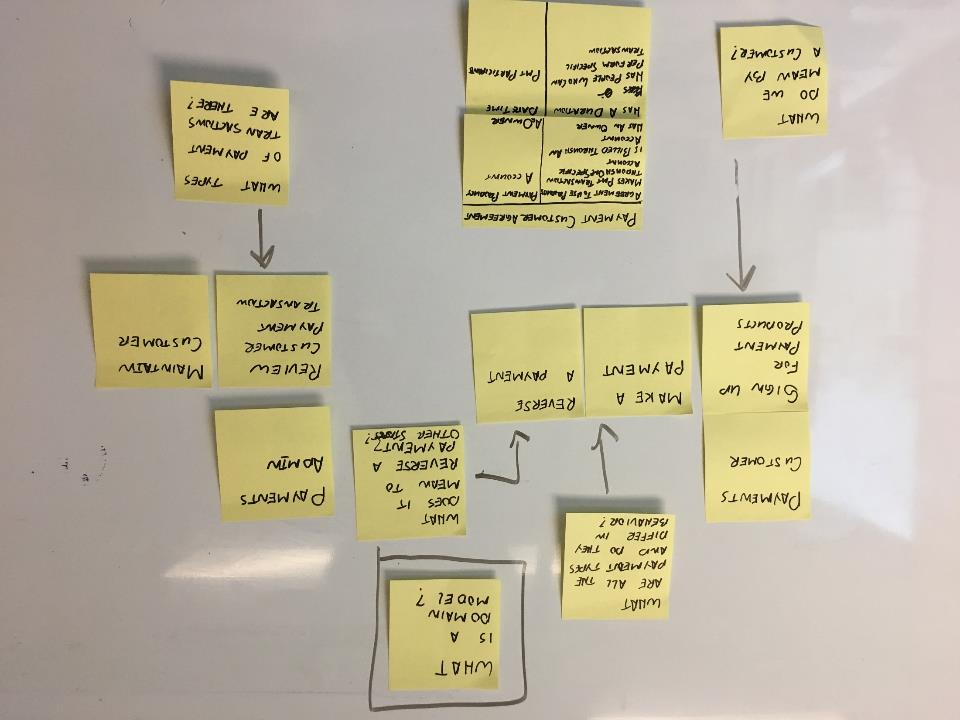

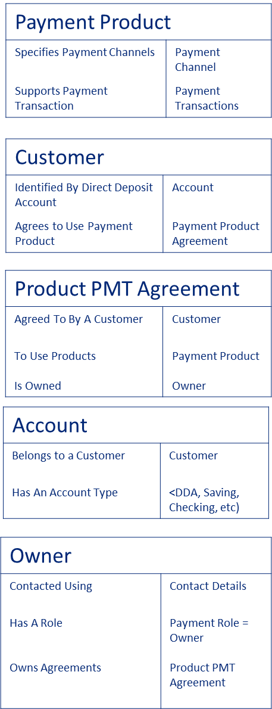

---

## Slide 11

Answers to these questions can be captured in a Domain Model, using CRC notation

---

---

---
---

*[Image(s) for Slide 11]*

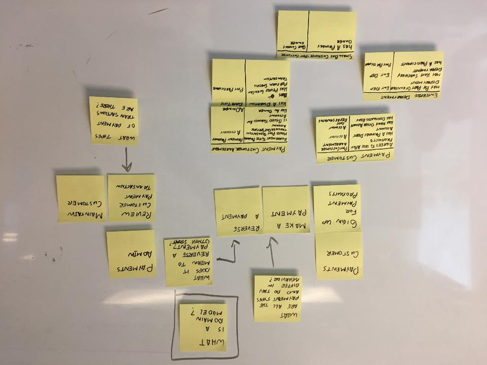

---

## Slide 12

Answers to these questions can be captured in a Domain Model, using CRC notation

---

---

---
---

*[Image(s) for Slide 12]*

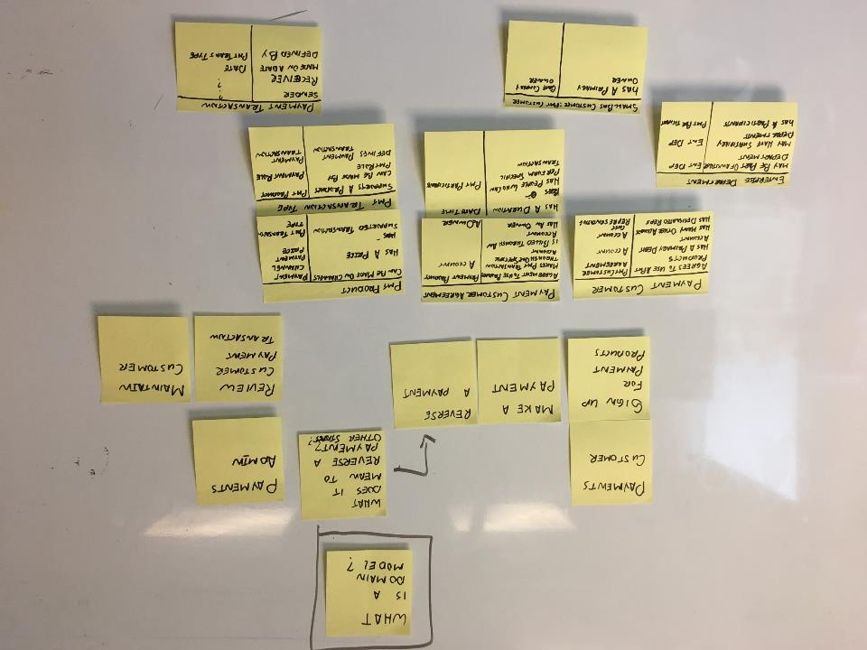

---

## Slide 13

A good Domain Model dramatically increases the pace of story discovery and exploration, domain concepts are captured in one place as understanding increases

---

---

---
---

*[Image(s) for Slide 13]*

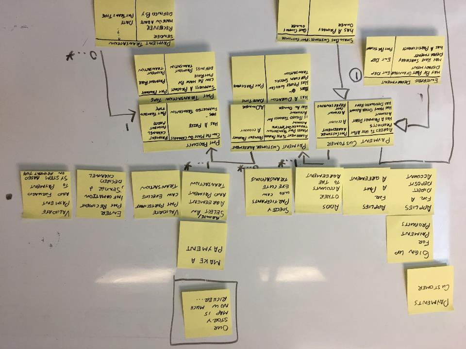

---

## Slide 14

Language is as (or more) important the diagram. Practice walking the model, describing each piece, this builds the common vocabulary being used by the team

---

---

---
---

*[Image(s) for Slide 14]*

---

## Slide 15

Language is as (or more) important the diagram. Practice walking the model, describing each piece, this builds the common vocabulary being used by the team

---

---

---
---

*[Image(s) for Slide 15]*

---

## Slide 16

Building a domain accelerates story mapping,  acceptance criteria, and Spec by example

There is a steep learning curve, and the initial complexity can / will put people off

It scales! Most of the work happens during the first few stories in an epic, covering additional stories become progressively easier and easier

For developers, it can feel like coding with stickies

Coaching Thoughts

---

---

## Slide 17

Outline a Story Map that captures some aspect of a project you are part of,

Keep it brief focus on the major epics, listing perhaps a few stories

Capture any questions you have regarding the business domain, ie business concepts, state, rules, logic or data

Exercise: Story Map and Domain Questions

---

---

## Slide 18

CRC components 101

---

---

## Slide 19

Each discrete part of the domain is captured as a Class

---

---

---
---

*[Image(s) for Slide 19]*

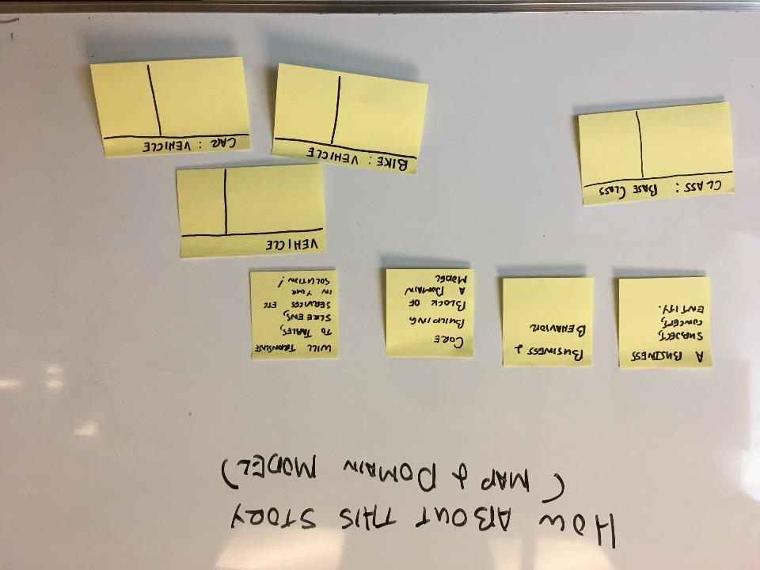

---

## Slide 20

Responsibilities are added to classes, and define the behaviour and data of that class

---

---

---
---

*[Image(s) for Slide 20]*

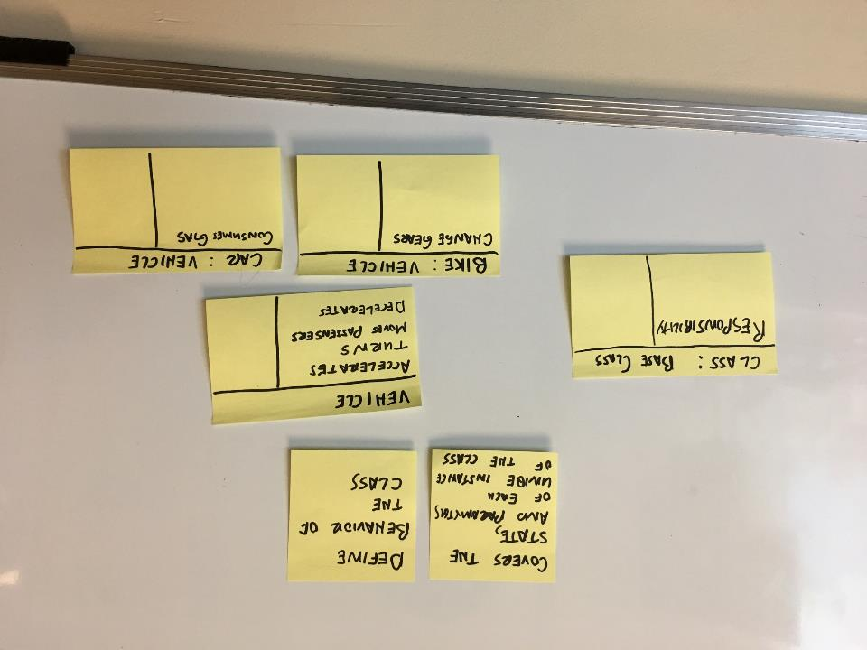

---

## Slide 21

Collaborators define the other classed that participate to fulfill a specific responsibility

---

---

---
---

*[Image(s) for Slide 21]*

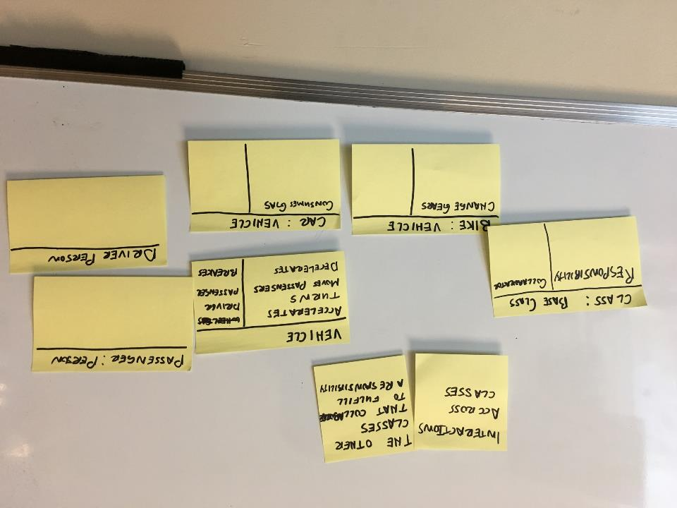

---

## Slide 22

Object oriented notation can be used to further define the relationships between various classes

---

---

---
---

*[Image(s) for Slide 22]*

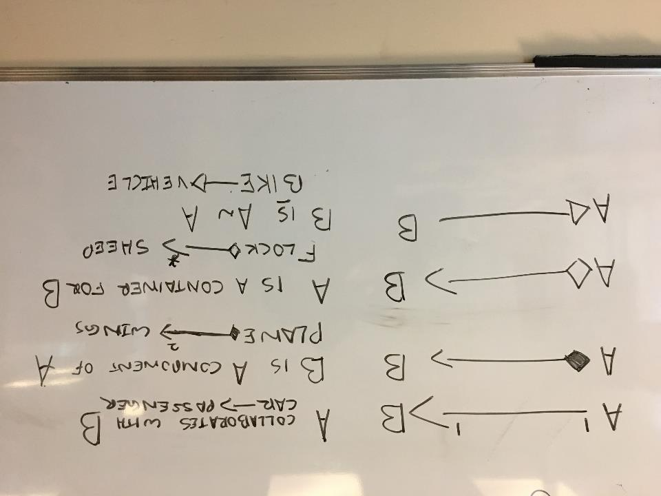

---

## Slide 23

Putting it together, a precise and concise way to describe how business logic works, in a format that can be easily translated to the actual solution

---

---

---
---

*[Image(s) for Slide 23]*

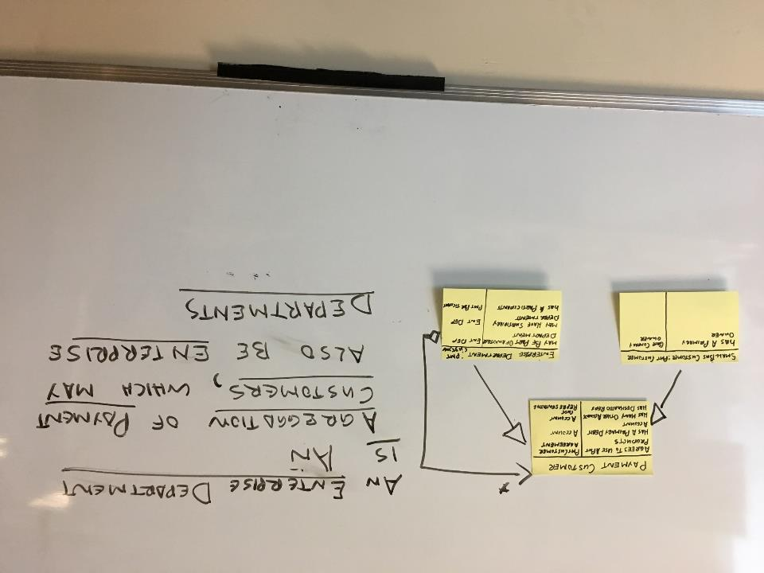

---

## Slide 24

Putting it together, a precise and concise way to describe how business logic works, in a format that can be easily translated to the actual solution

---

---

---
---

*[Image(s) for Slide 24]*

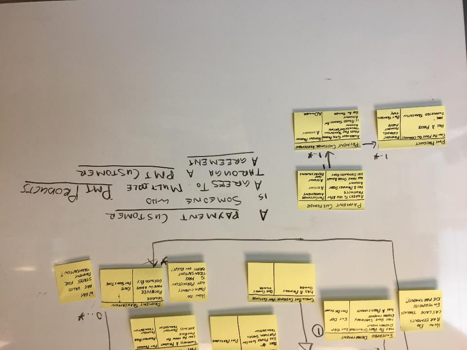

---

## Slide 25

Domain Modelling throughout the agile lifecycle

---

---

## Slide 26

Start by modelling functional behaviour (story map, acceptance criteria, spec by example, etc)

Ask domain related questions

What do you mean by X?

Explain the difference between an X and a Y

Describe all the different types of XWhat happens When X does Y?

What the F&@@!& is an X again?

Rephrase the answer in the domain model format (ah ha! So an X is for/does/behaves like….)

Update your model to capture the insight

Update your stories as necessary

Pause every so often and walk the model

Flesh out your domain model in parallel with story exploration

---

---

## Slide 27

---

---

---
---

*[Image(s) for Slide 27]*

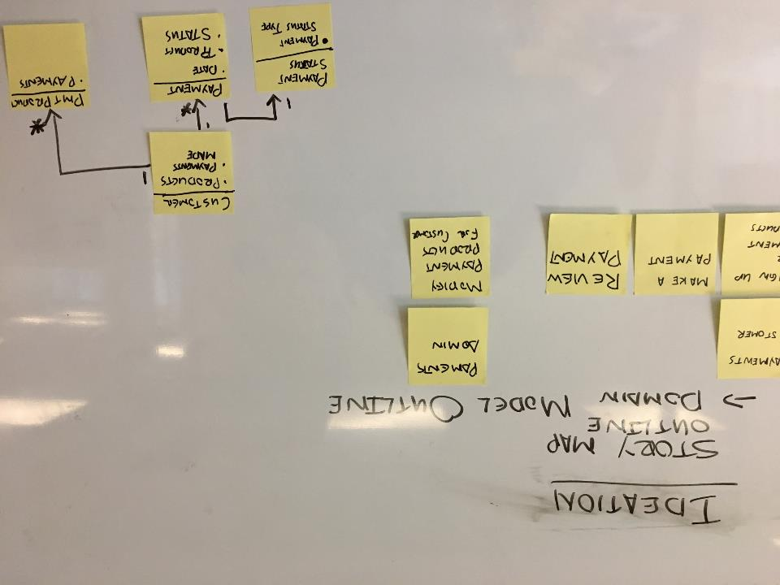

---

## Slide 28

Walk through your story map and build out an initial domain model

Don’t worry about being complete or precise, focus on major concepts and responsibilities

Exercise: Outline your Domain Model

---

---

## Slide 29

---

---

---
---

*[Image(s) for Slide 29]*

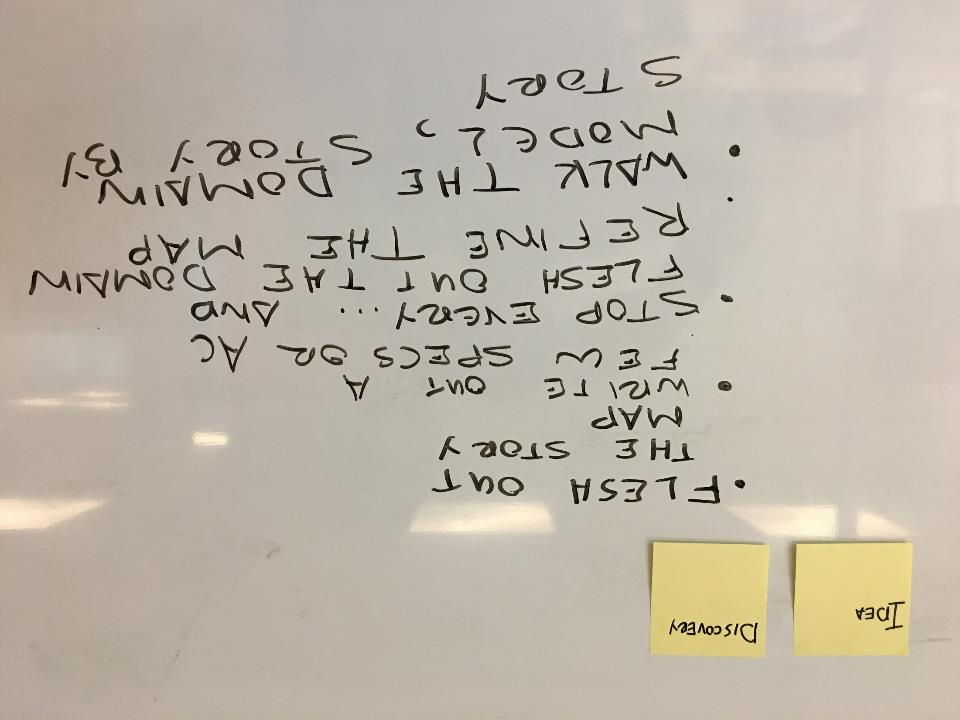

---

## Slide 30

---

---

---
---

*[Image(s) for Slide 30]*

---

## Slide 31

Refine your story map to a greater level

Add details around some key functions and stories, try to tack each major domain area in part

Refine the domain model to answer domain questions across each story

Exercise: Flesh out your Domain Model

---

---

## Slide 32

Validate the domain model by walking through individual stories, tracing the connections and collaborators in the map to see if there is a missing concept

---

---

---
---

*[Image(s) for Slide 32]*

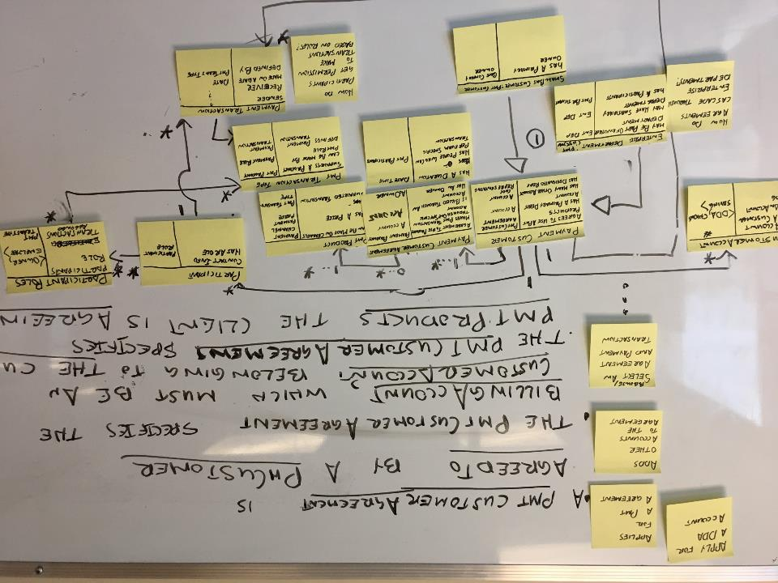

---

## Slide 33

Can the class take a crack at walking the domain model using this story? Does it reveal any missing pieces in the model?

---

---

## Slide 34

Take a set of stories and walk the model to validate the model is complete

Take note of missing sections and update your model as necessary

Refine the domain model to answer domain questions across each story

Present the model to the class

Exercise: Validate your domain model through walkthroughs

---

---

## Slide 35

Apply For a Payment Product Agreement

Story Acceptance Criteria

The Customer must provide a valid DDA Account that the Customer owns

The Customer may apply for one or more Payment Products, each application results in a separate Payment Product Agreement

Each Ap

The Customer must specify an Owner, providing the necessary Contact Details

Idea

Discovery

Delivery

Customer

Identified By Direct Deposit Account | Account

Agrees to Use Payment Product | Payment Product Agreement

Product PMT Agreement

Agreed To By A Customer | Customer

To Use Products

Is Owned | Payment Product

Owner

Owner

Contacted Using | Contact Details

Has A Role

Owns Agreements | Payment Role = Owner

Product PMT Agreement

Acceptance criteria are easier to do with a domain model in place

Acceptance criteria also provide excellent input into your domain model!

Account

Belongs to a Customer | Customer

Has An Account Type | <DDA, Saving, Checking, etc)

---

---

## Slide 36

Idea

Discovery

Delivery

Detailed Domain Modelling and Spec by Example can be done in parallel

Acceptance criteria are also an excellent time to build and refine your domain model!

Apply For a Payment Product Agreement

Story Scenario

Given the following Payments Products exist

And the following Customer exist

With a valid DDA Account

When the Customer applies for a Payment Product Agreement

using his DDA Account

with an Owner

that has the following Contact Details

Then the Payment Product Agreement will be submitted to…

---

---

---
---

*[Image(s) for Slide 36]*

---

## Slide 37

Take an individual story and define it in terms of Acceptance Criteria and / or Specification Scenarios

Write each AC / Scenario step in a way that explicitly calls out the concepts in your domain model

Elaborate / refine the domain model as you go

Validate the domain model by walking through the story

Exercise: Detail the Domain Model

---

---

## Slide 38

Refining your Modelling

---

---

## Slide 39

Avoid many to many relationship create a card to represent the relationship

Avoid dependency magnets break up classes with to many responsibilities into discrete domain concepts

Evolve “generic” responsibilities  into domain specific ones

Use Abstractions Push behavior found in multiple places into a common class; use inheritance to “inject” the common behavior into these subject areas

Meta Layer consider moving the configurable part into a separate set of classes, known as a “meta layer”

Walk the Model whenever getting “lost in the model ground the conversation by walking the model through a scenario

Connect to architecture “Annotate and inject” common functionality through inheritance, and collect common behavior into a set of requirements that influence the choice of technology, patterns and/or APIs

Establish boundaries Where multiple teams / systems connect and overlap, call out mapping and integration mechanism; try to express dependencies in terms of specific domain concepts

There are a lot of traps to avoid when writing a domain models, follow these best practices:

As a Class which of these do we want to explore?

---

---

## Slide 40

When you have a many to many relationship, that is a STRONG signal that you need to create a card to represent the relationship

---

---

---
---

*[Image(s) for Slide 40]*

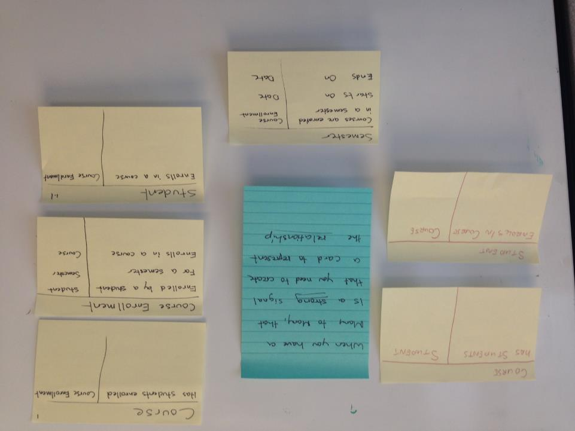

---

## Slide 41

Avoid dependency magnets; break up classes that have too many responsibilities into discrete domain concepts that match the business language used to describe different concepts being represented by the class

---

---

---
---

*[Image(s) for Slide 41]*

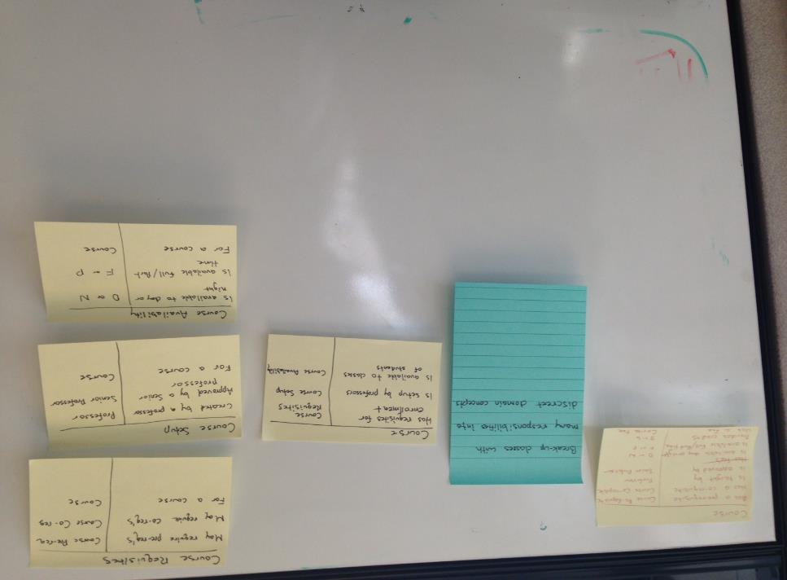

---

## Slide 42

Evolve “generic” responsibilities and collaborations into responsibilities that are domain driven, and express the business language involved

---

---

---
---

*[Image(s) for Slide 42]*

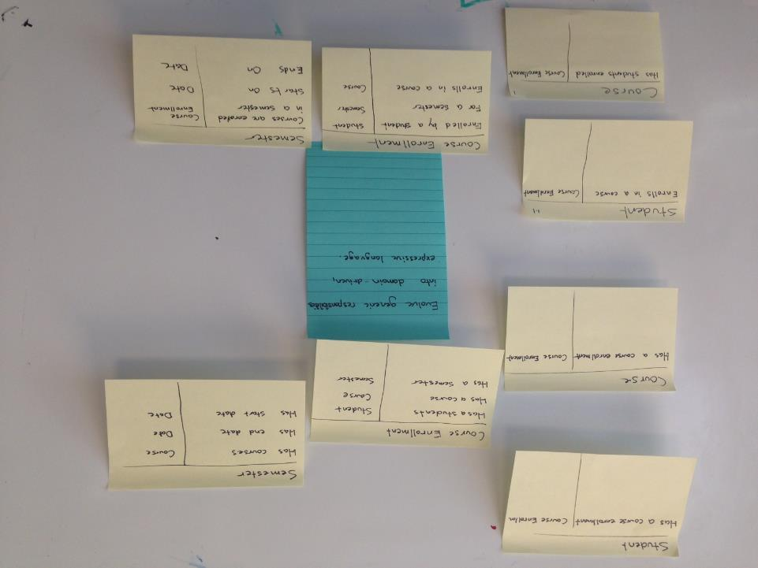

---

## Slide 43

Consider pushing behavior found in multiple places into a common class that describes the key domain concept common across domain subject areas; use inheritance to “inject” the common behavior into these subject areas

---

---

---
---

*[Image(s) for Slide 43]*

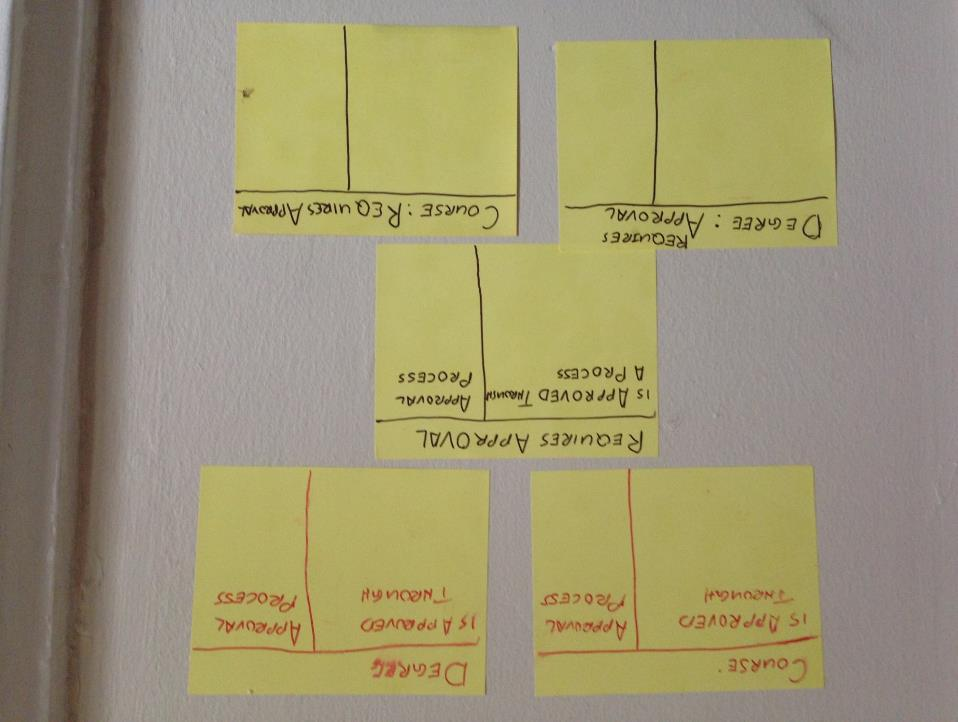

---

## Slide 44

When parts of your system are “configurable” consider moving the configurable part into a separate set of classes, known as a “meta layer”

---

---

---
---

*[Image(s) for Slide 44]*

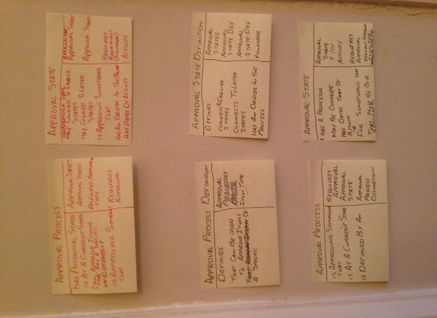

---

## Slide 45

Always ground the conversation by walking the model through a scenario, repeat the scenario walk-through whenever getting “lost in the model

---

---

---
---

*[Image(s) for Slide 45]*

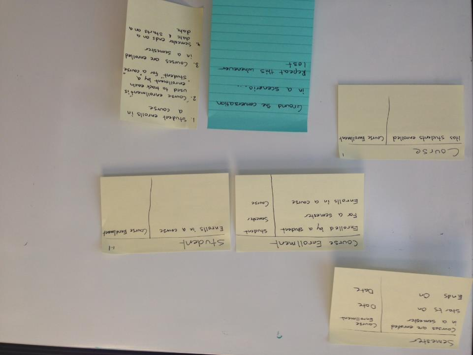

---

## Slide 46

When walking a CRC model in support of a user story or scenario, start with the class that represents a persona, person or role. Make sure that the responsibilities of this “boundary” class aligns to a user story on the story map

---

---

---
---

*[Image(s) for Slide 46]*

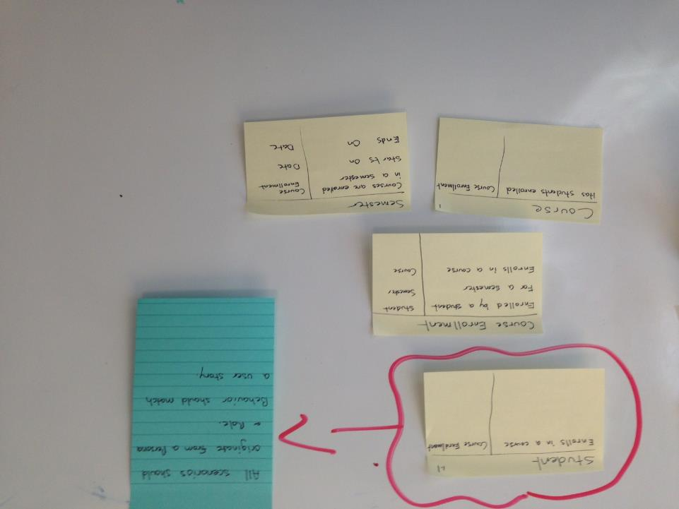

---

## Slide 47

Annotate the model with questions, and require clarifications, then make sure to update the model based on the answers

---

---

---
---

*[Image(s) for Slide 47]*

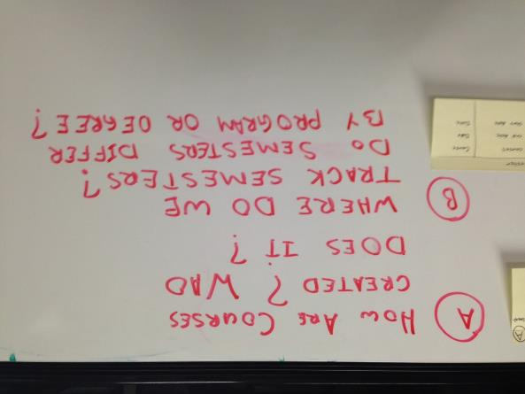

---

## Slide 48

Connect the model to architecture by “injecting” common functionality through inheritance, collect common behavior into a set of requirements that influence the choice of technology, patterns and/or APIs

---

---

---
---

*[Image(s) for Slide 48]*

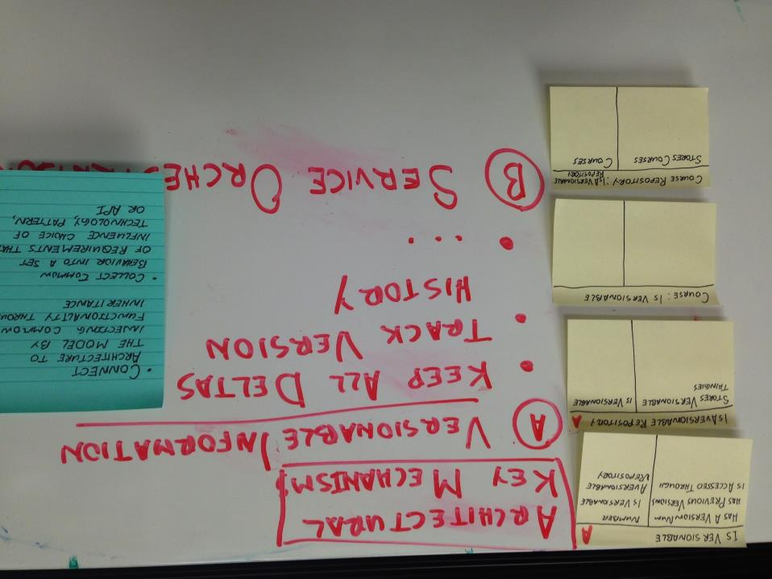

---

## Slide 49

Establish boundaries of meaning across different teams and systems; calling out mapping and integration mechanism

Identify key domain constructs/objects that are relevant to both the business and the system to play

Draw boundaries around constructs according to when the context changes ( different system, different team)

Establish relationships and dependencies across different contexts

For each relationship/dependency identify what integration pattern makes the most sense

Establishing integration approach/policy between context owners for each dependency found

---

---

---
---

*[Image(s) for Slide 49]*

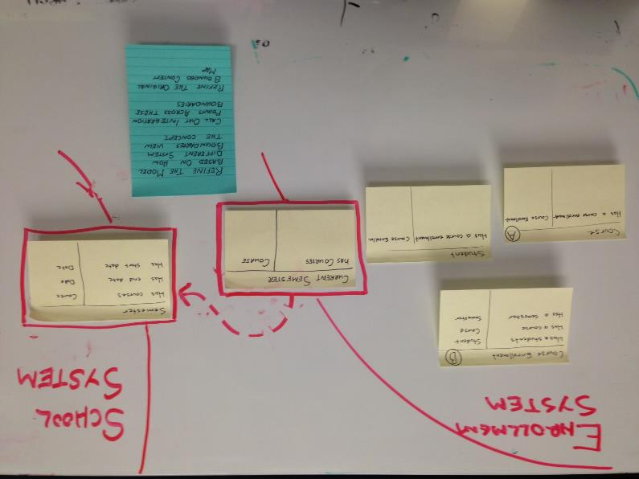

---

## Slide 50

Use a deliberate strategy to ensure that models stay consistent within and across different team and system boundaries

Keep elements in a model boundary consistent

Models will fragment when worked on by multiple parties in parallel

Continuous Integration of both concepts and implementation is required to stay in synch

High level of rigour; only required within an individual bounded countext

Synchronize across boundaries according to the nature of the dependency

Establishing clear boundaries for each context in play

Identifying relationships across the different context based on dependencies

Define an integration strategy to govern how different team will resolve and synchronize each cross context dependency

---

---

---
---

*[Image(s) for Slide 50]*

---

## Slide 51

Make improvements to your model based on the practices that apply to your context

Socialize with team

Exercise: refine your Model based on the best practices above

---

