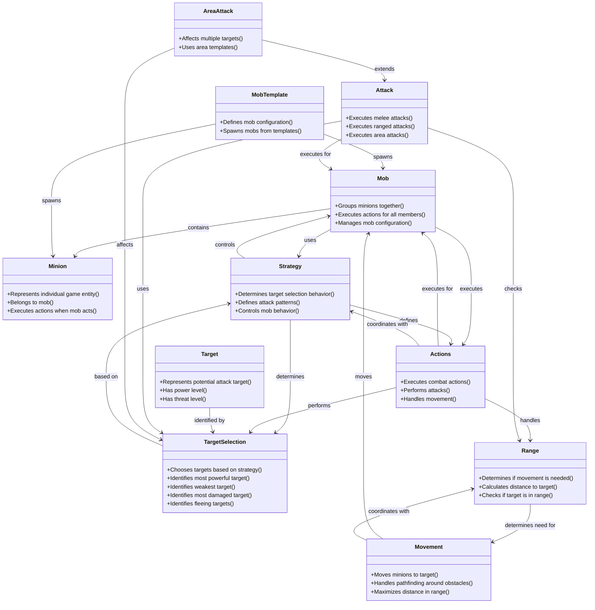
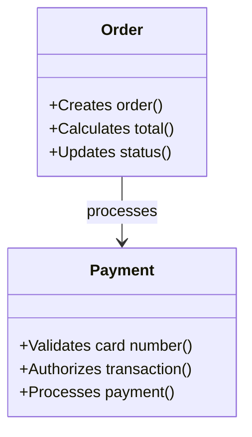

# Domain Model Diagram: Mob Minion

**File Name**: `mob-minion-domain-model-diagram.md`
**Location**: `demo/mob_minion/mob-minion-domain-model-diagram.md`

## Solution Purpose
Virtual tabletop game management - specifically minion/mob combat management within Foundry VTT.

---

## Domain Model Diagram

**Example:**

**Diagram Notes:**
- Domain concepts are shown as classes with their responsibilities
- Responsibilities are listed as methods in the class (format: +{responsibility}())
- Relationships show dependencies and associations between concepts
- Inheritance relationships show specialization (--|>)
- Associations show usage and collaboration (-->)

---

## Source Material

**Source**: story-graph.json domain_concepts extracted from epics and sub_epics
**Generated**: 2024-12-19
**Context**: Domain concepts identified during story shaping phase for mob minion management system

