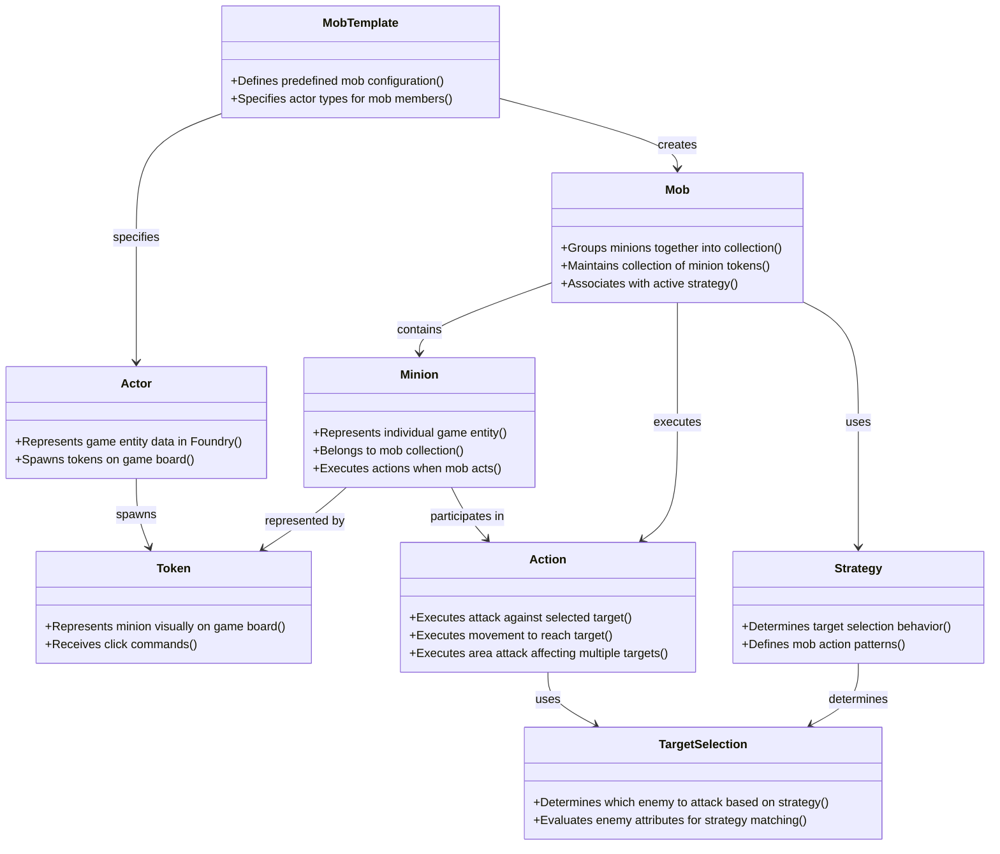

# Domain Model Diagram: Mob Minion Management

**File Name**: `mob-minion-domain-model-diagram.md`
**Location**: `demo/mob_minion/docs/stories/mob-minion-domain-model-diagram.md`

## Solution Purpose
Enable Game Masters using Foundry VTT to efficiently manage groups of minions (mobs) that can act together as a single unit. The system allows GMs to create mobs by grouping minion tokens, assign behavioral strategies to mobs, and execute coordinated actions for all minions in a mob with a single click.

---

## Domain Model Diagram

**Diagram Notes:**
- Domain concepts are shown as classes with their responsibilities
- Responsibilities are listed as methods in the class (format: +{responsibility}())
- Relationships show dependencies and associations between concepts
- Inheritance relationships show specialization (--|>)
- Associations show usage and collaboration (-->)

---

## Source Material

- Original user input describing the need for mob management in Foundry VTT
- Clarification data capturing user types, goals, and domain concepts
- Story graph defining epics, sub-epics, and stories for mob management functionality

