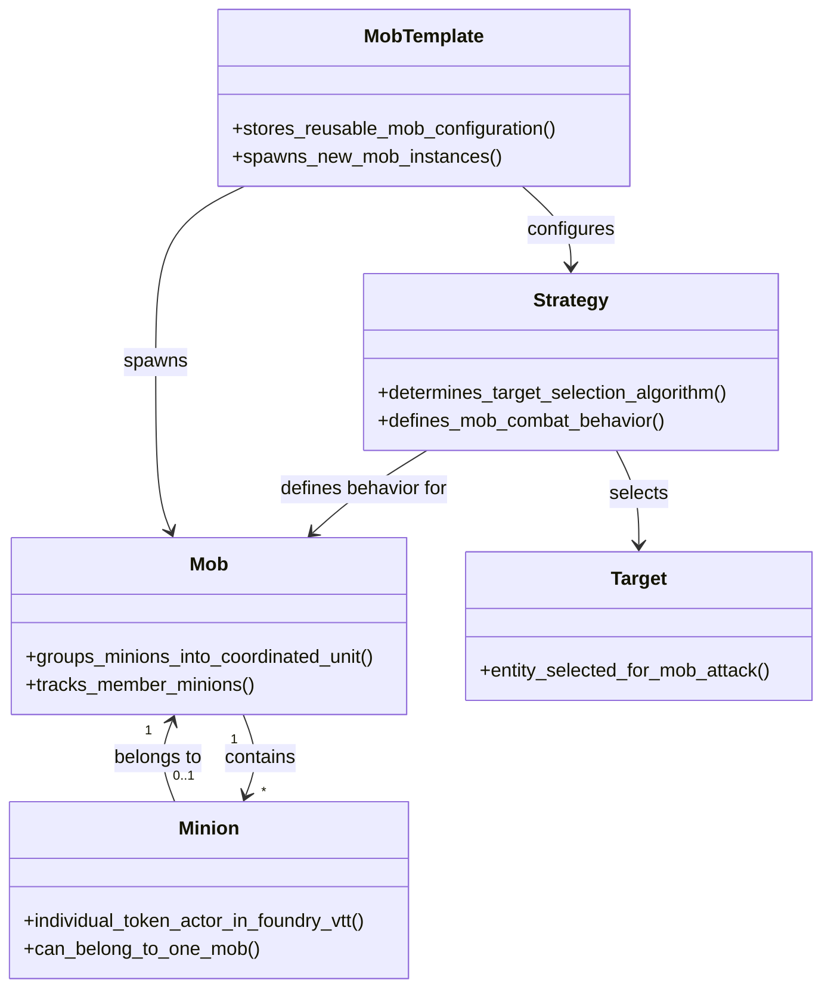
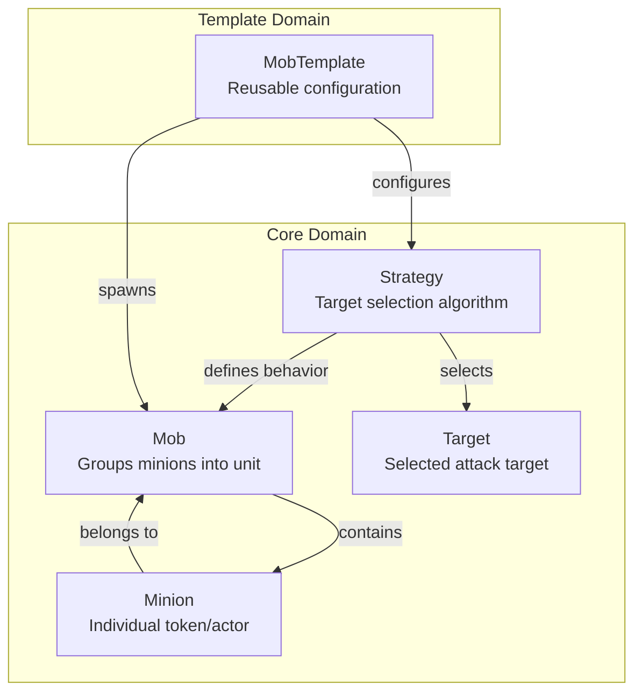

# Domain Model Diagram: Mob Minion

**File Name**: `mob-minion-domain-model-diagram.md`
**Location**: `demo/mob_minion/docs/stories/mob-minion-domain-model-diagram.md`

## Solution Purpose

Streamline minion management during combat in Foundry VTT for Mutants & Masterminds 3rd Edition. The Mob Minion module allows Game Masters (GMs) to control groups of minions (mobs) with a single interaction instead of clicking each individually.

---

## Domain Model Diagram

## Relationship Summary

## Domain Concepts by Epic

### Epic: Manage Mobs
- **Mob**: Groups minions, tracks members
- **Minion**: Individual token, belongs to mob

### Epic: Configure Strategy
- **Strategy**: Target selection, combat behavior
- **Target**: Selected attack entity

### Epic: Mob Templates
- **MobTemplate**: Stores config, spawns instances

---

## Source Material

**Primary Source:** `demo/mob_minion/input.txt`
**Game System:** Mutants & Masterminds 3rd Edition (Hero SRD)
**Platform:** Foundry Virtual Tabletop (Foundry VTT)
**Date Generated:** 2025-12-16
**Context:** Shape phase - Domain diagram generated from story-graph.json
