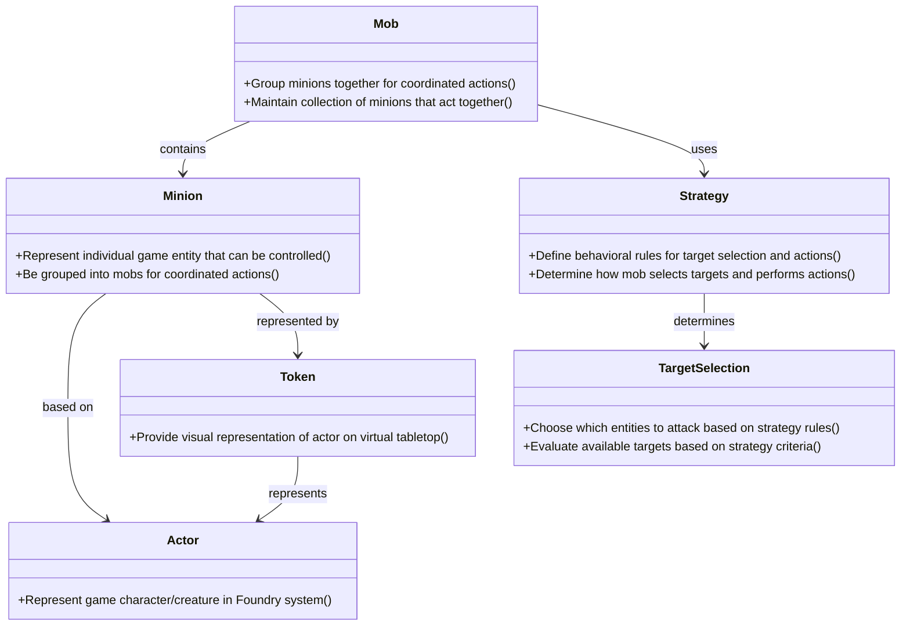

# Domain Model Diagram: Mob Minion

**File Name**: `mob-minion-domain-model-diagram.md`
**Location**: `demo/mob_minion/mob-minion-domain-model-diagram.md`

## Solution Purpose
Mob Minion is a feature extension for the Foundry Virtual Tabletop system that enables Game Masters to efficiently manage groups of minions (mobs) during combat encounters. The system allows GMs to group minion tokens together so they can be controlled with single actions rather than requiring individual clicks on every minion token. Once grouped into mobs, strategies can be applied to determine how the mob selects targets and performs coordinated actions.

---

## Domain Model Diagram

**Diagram Notes:**
- Domain concepts are shown as classes with their responsibilities
- Responsibilities are listed as methods in the class (format: +{responsibility}())
- Relationships show dependencies and associations between concepts
- Inheritance relationships show specialization (--|>)
- Associations show usage and collaboration (-->)

---

## Source Material

**Primary Source**: `demo/mob_minion/docs/stories/story-graph.json`
**Sections Referenced**: 
- Epic 1 "Manage Mobs" - domain_concepts section (Mob, Minion, Actor, Token)
- Epic 2 "Apply Strategies to Mobs" - domain_concepts section (Strategy, Target Selection)
**Date Generated**: 2025-12-06
**Context Note**: Domain concepts extracted from story-graph.json epics and sub-epics. All domain concepts represent core business entities in the virtual tabletop combat management domain.
